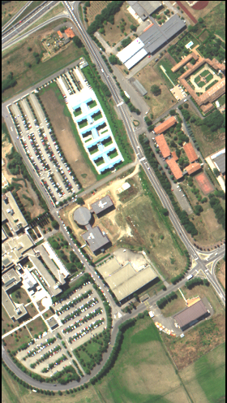
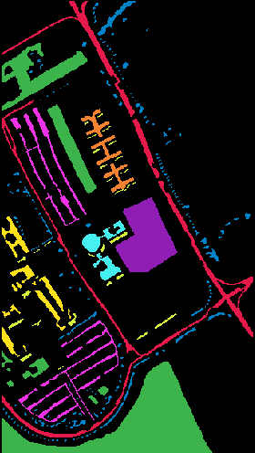
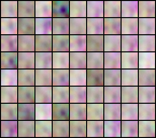
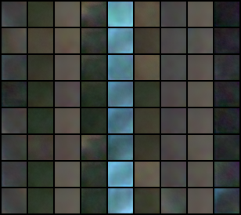
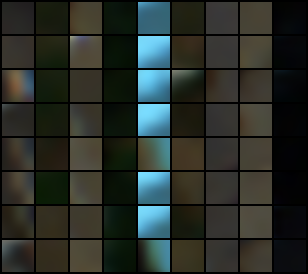

<!--
SPDX-FileCopyrightText: 2024, Antón Gómez López

SPDX-License-Identifier: GPL-3.0-or-later
-->

# Conditional StyleGAN2 in Pytorch for Multispectral Image Classification

This repository is a conditioned version of [lucidrains' repository](https://github.com/lucidrains/stylegan2-pytorch). The paper presenting the StyleGAN2 architecture can be found [here](https://arxiv.org/abs/1912.04958).

## Project Description :ledger:

This network was used to classify multispectral images of Galician rivers obtained through remote sensing. The images were taken with the aim of automatically monitoring the river basins of Galicia. Specifically, the goal is to determine the state of the vegetation, identify areas occupied by invasive species, and detect artificial structures that occupy the river basin using multispectral images.

In particular, these are 8 high-resolution multispectral images that were used in [this paper](https://www.mdpi.com/2072-4292/13/14/2687) to evaluate various segmentation and classification algorithms. The images consist of five bands corresponding to the following wavelengths: 475 nm (blue), 560 nm (green), 668 nm (red), 717 nm (red-edge), and 840 nm (near-infrared).

These datasets present two main challenges:

- Large sample imbalance between classes.
- Scarcity of samples for some classes.

Thus, this GAN was used to try to address these issues by augmenting the dataset with the generator and using the discriminator as a classifier. The results obtained were worse than expected and similar to those achieved using a standard convolutional network.

### Experiment Replication :bar_chart:

The network's ability to classify multispectral images was evaluated in the following bachelor's thesis: [Effective adaptation of generative adversarial networks for processing multidimensional remote sensing images](https://nubeusc-my.sharepoint.com/:b:/g/personal/anton_gomez_lopez_rai_usc_es/EbY99we4GYRIsw4A0Zq3nhEBSVcDZ19kQSEA426UbsMTBg?e=Rk6hR8). In this work, a series of experiments were conducted, in which various hyperparameters of the network were tested, and an adaptive learning rate was introduced.

If you have access to the multispectral datasets corresponding to the 8 Galician rivers used in the experiments, they can be reproduced by running the bash `scripts` located in the scripts directory:

- Experiment 1: `1_mnist.sh`.
- Experiment 2-1: `2_1_learning_rate.sh`.
- Experiment 2-2: `2_2_network_capacity.sh`.
- Experiment 2-3: `2_3_ada_learning_rate.sh`.
- Experiment 3: `3_all_datasets.sh`.

### Future Directions :telescope:

- [ ] Conduct a deeper study on the influence of dataset imbalance on the performance of the conditioned StyleGAN2 in classification and image generation problems conditioned on a class label.
- [ ] Explore different modifications to the conditioned StyleGAN2 architecture to improve its performance in classification problems, such as those presented by ResBaGAN.

## Requirements :page_with_curl:

An `environment.yml` file is provided to create a Conda environment with the necessary dependencies. To create the environment, run:

```bash
conda env create -f environment.yml
```

**Note**: A GPU with CUDA support is required to run the network. All experiments were conducted on a TESLA T4 GPU with 16GB of memory.

## Datasets :file_folder:

The multispectral datasets used are not yet publicly available. However, the Computational Intelligence Group at the University of the Basque Country provides a series of multispectral datasets. You can find more information in the [group's page](https://www.ehu.eus/ccwintco/index.php/Hyperspectral_Remote_Sensing_Scenes).

In particular, the network is prepared to process one of these multispectral images: _Pavia University_. It is possible to download all necessary files (including the segmented image and the centres) from this [OneDrive folder](https://nubeusc-my.sharepoint.com/personal/anton_gomez_lopez_rai_usc_es/_layouts/15/onedrive.aspx?sw=bypass&bypassReason=abandoned&id=%2Fpersonal%2Fanton%5Fgomez%5Flopez%5Frai%5Fusc%5Fes%2FDocuments%2FTFG%2FStyleGAN2%2Dcondicionada%2Dclasificacion%2Fdata%2FPAVIA&ga=1).

The Pavia University image files must be placed in the `data/PAVIA` directory and named as follows:

- Image: `pavia_university.raw`.
- Ground Truth: `pavia_university_gt.pgm`.
- Segment Map: `pavia_university_seg.raw`.
- Segment Centers: `pavia_university_seg_centers.raw`.

Additionally, the network also works with datasets that contain RGB or black-and-white images. The `datasets` directory includes the MNIST dataset.

The multispectral image of Pavia University can be visualized by extracting the RGB channels. Additionally, the ground truth can be used to see which pixels belong to each class.

<div style="display: flex; justify-content: center; text-align: center;">
  <div style="margin-right: 10px;">



_Pavia University Multispectral Image in RGB_

  </div>
  <div style="margin-left: 10px;">



_Pavia University Ground Truth_

  </div>
</div>

As seen in the ground truth, there are some black pixels, which means they are not labeled. The classes present are the following:

- <div style="display: flex; align-items: center">Asphalt: raspberry red <span style="display: inline-block; width: 15px; height: 15px; background-color: #e6194b; border-radius: 50%; margin-left: 8px"></span></div>
- <div style="display: flex; align-items: center">Meadows: green <span style="display: inline-block; width: 15px; height: 15px; background-color: #3cb44b; border-radius: 50%; margin-left: 8px"></span></div>
- <div style="display: flex; align-items: center">Gravel: yellow <span style="display: inline-block; width: 15px; height: 15px; background-color: #ffe119; border-radius: 50%; margin-left: 8px"></span></div>
- <div style="display: flex; align-items: center">Trees: blue <span style="display: inline-block; width: 15px; height: 15px; background-color: #0082c8; border-radius: 50%; margin-left: 8px"></span></div>
- <div style="display: flex; align-items: center">Metal: orange <span style="display: inline-block; width: 15px; height: 15px; background-color: #f58230; border-radius: 50%; margin-left: 8px"></span></div>
- <div style="display: flex; align-items: center">Bare soil: purple <span style="display: inline-block; width: 15px; height: 15px; background-color: #911eb4; border-radius: 50%; margin-left: 8px"></span></div>
- <div style="display: flex; align-items: center">Bitumen: light blue <span style="display: inline-block; width: 15px; height: 15px; background-color: #46f0f0; border-radius: 50%; margin-left: 8px"></span></div>
- <div style="display: flex; align-items: center">Bricks: light purple <span style="display: inline-block; width: 15px; height: 15px; background-color: #f032e6; border-radius: 50%; margin-left: 8px"></span></div>
- <div style="display: flex; align-items: center">Shadows: light yellow <span style="display: inline-block; width: 15px; height: 15px; background-color: #d2f53c; border-radius: 50%; margin-left: 8px"></span></div>

## Usage :wrench:

### MNIST

Within the scripts directory, there are several bash scripts. The `1_mnist.sh` script allows training the model with the MNIST dataset:

```bash
bash scripts/1_mnist.sh
```

This script allows modifying the number of train steps, as well as the learning rate of the discriminator and the generator. The save every and evaluate every parameters allow setting how many batches are processed before saving the model weights and generating a series of images per class, respectively.

### PAVIA

Within the scripts directory, a script is also provided to perform training with the Pavia University multispectral image (`scripts/pavia_example.sh`). It is necessary to download the dataset files from [here](https://nubeusc-my.sharepoint.com/personal/anton_gomez_lopez_rai_usc_es/_layouts/15/onedrive.aspx?view=0&id=%2Fpersonal%2Fanton%5Fgomez%5Flopez%5Frai%5Fusc%5Fes%2FDocuments%2FTFG%2FStyleGAN2%2Dcondicionada%2Dclasificacion%2Fdata%2FPAVIA).

To evaluate pixel-level accuracy, the `cstylegan2/test_D.py` Python script can be used.

#### Example

After cloning the repo, installing the dependencies, and downloading the Pavia University dataset, run the following command to train the network:

```bash
python cstylegan2/run.py data/PAVIA --channels=5 --num_train_steps=100 --evaluate_every=44 --save_every=44 --name=PAVIA
```

First, the dataset will be loaded, consisting of a high-resolution multispectral image of Pavia University. The network uses 32x32 pixel patches from the multispectral image, centred on the segments defined in the `pavia_university_seg_centers.raw` file.

As the image has 5 channels, the `--channels=5` flag specifies this. The dataset is split into training and validation sets, with the following default split:

- Training set: 15% of each class.
- Validation set: 5% of each class.

The network will train for 100 steps, saving a model every epoch (44 batches). If you modify the batch size and still want to save a model per epoch, adjust the number of steps for saving and evaluation by dividing the total number of batches by the batch size.

During training, the network generates a mosaic of images every 44 batches (effectively after each epoch). This mosaic contains 8 generated images for each of the 9 classes in this classification problem. Initially, the generated images will be quite noisy, but as training progresses, the quality of the generated images will improve significantly.

<div style="display: flex; justify-content: center; text-align: center;">
  <div style="margin-right: 10px;">



_Generated patches in epoch 10_

  </div>
  <div style="margin-left: 10px;">



_Generated patches in epoch 100_

  </div>
  <div style="margin-left: 10px;">



_Real patches of the Pavia University image_

  </div>
</div>

After training is complete, you can generate images conditioned on specific class labels. The `cstylegan2/test_G.py` script allows you to generate images for each class in the dataset. This script accepts two parameters:

- **name**: The name used during training, in this case, `PAVIA`.
- **model** (optional): The number of the saved model to use. If not specified, the latest saved model will be used.

To run the script and generate images, use the following command:

```bash
python cstylegan2/test_G.py --name=PAVIA
```

The script will generate 8 images for each class in the dataset. These images will be saved in the `test/PAVIA/G` directory.

For the classification task, the network logs the overall accuracy and class-wise accuracy for both the training and validation sets each time a model is saved. To identify the best model from the training process, you can use the `select_best_model.py` script. This script analyses the validation log files and selects the model with the highest average accuracy.

The script returns the model number with the highest average accuracy. To evaluate this model, use the test_D.py script, which accepts the following parameters:

- **folder**: The directory where the dataset is stored, e.g., `data/PAVIA`.
- **name**: The name used for training the network, e.g., `PAVIA`.
- **model**: The number of the best model selected during training.

To evaluate the best saved model, run the following command:

```bash
python cstylegan2/test_D.py data/PAVIA --folder=data/PAVIA --name=PAVIA --model=NUMBER_OF_THE_BEST_MODEL
```

The script will output the overall accuracy, average accuracy per class, and the accuracy for each individual class.

## License :memo:

This repository is under the GNU General Public License v3.0. See the `LICENSE` file for more details.
